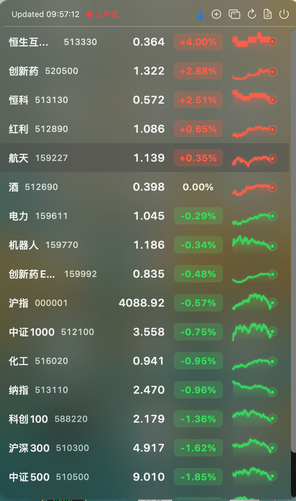

# StockBar

原生 macOS 菜单栏应用，显示 A 股 / ETF 自选列表，内置**分钟级迷你走势图**（Stats 风格），点击可查看个股分时图，并为 MacBook Pro 用户提供 **Touch Bar 集成**。菜单栏和 Touch Bar 功能均可**独立配置** — 通过内置偏好设置窗口独立启用/禁用。



## 功能特性

- **统一应用** — 一个应用同时支持菜单栏和 Touch Bar，可独立配置
- **菜单栏集成** — 常驻状态栏图标，点击展开完整自选列表
- **Touch Bar 支持** — MacBook Pro 的 Touch Bar 直接显示实时行情和分时图，支持智能滚动和排序
- **可配置界面** — 通过偏好设置窗口（齿轮图标）独立启用/禁用菜单栏或 Touch Bar
- **内嵌迷你走势** — Stats 风格的分钟级趋势可视化，每只股票一条
- **交互式图表** — 点击任意行展开完整分时图（09:30–15:00）
- **纯 Swift + AppKit** — 运行时无需 Xcode 项目，不依赖 Electron 或 Python
- **轻量级** — 内存占用约 80 MB，以菜单栏代理运行（不显示 Dock 图标）
- **交易时段感知** — 交易时段每 5 秒刷新，午休/盘前盘后 60 秒，周末 600 秒
- **实时重载** — 监听 `watchlist.json` 文件变化，任何外部编辑立即触发刷新

---

## 截图展示

### 菜单栏弹窗

弹窗显示完整自选列表：
- 当前市场阶段指示器（盘前 / ● 上午盘 / 午休 / ● 下午盘 / 已收盘 / 周末休市）
- 每只股票显示：别名 · 6 位代码 · 价格 · 今日涨跌幅 · 迷你走势
- 点击任意行在列表下方展开完整分时图
- 顶部按钮：`⟳` 刷新、`⚙️` 偏好设置、`📄` 打开 watchlist.json、`⏻` 退出

### 偏好设置

点击弹窗顶部的齿轮图标（`⚙️`）打开偏好设置窗口：
- **显示菜单栏图标** — 开启/关闭菜单栏状态栏图标
- **显示 Touch Bar** — 开启/关闭 Touch Bar 集成（无 Touch Bar 的设备自动禁用）
- 更改立即生效，无需重启应用
- 至少需要保持一个界面启用

### Touch Bar


横向滚动的行情列表，智能保持滚动位置。


点击任意股票，直接在 Touch Bar 上查看完整分时图。


排序按钮循环切换：**列表顺序** → **涨幅榜** → **跌幅榜** → 回到列表顺序。

---

## 构建

需要 Xcode 工具链。内置脚本默认使用外置 Xcode 路径 `/Volumes/disk/Applications/Xcode.app`；如果你的 Xcode 在其他位置，可以通过 `DEVELOPER_DIR=/path/to/Xcode.app/Contents/Developer` 覆盖。

```bash
./scripts/make-app.sh           # release 构建 → ./build/StockBar.app
./scripts/make-app.sh debug     # debug 构建（更快，体积更大）
```

运行：

```bash
open ./build/StockBar.app
```

停止：

```bash
# 方式一：点击弹窗顶部的 ⏻ 图标退出
# 方式二：使用命令行
pkill -f 'StockBar.app/Contents/MacOS/StockBar'
```

安装（可选）：

```bash
cp -R ./build/StockBar.app /Applications/
```

开机自启：将 `StockBar.app` 拖入 **系统设置 → 通用 → 登录项**。

---

## 交互方式

### 菜单栏

- 点击菜单栏图标 → 弹出完整自选列表
- 每行显示：别名 · 6 位代码 · 价格 · 今日涨跌幅 · 迷你走势
- **点击某一行** → 在列表下方展开该股票的完整分时图。再次点击同一行折叠
- 点击弹窗外部（或切换到其他应用）→ 弹窗自动关闭
- 顶部按钮：
  - `⟳` — 立即强制刷新
  - `⚙️` — 打开偏好设置，切换菜单栏 / Touch Bar
  - `📄` — 用默认编辑器打开 `watchlist.json`
  - `⏻` — 退出 StockBar

### Touch Bar（MacBook Pro）

- **Scrubber** — 横向滚动列表，显示所有股票的实时价格和涨跌幅
- **点击任意股票** — 打开 Touch Bar 模态视图，显示完整分时图
- **排序按钮** — 循环切换三种模式：
  1. **列表顺序** — 按 `watchlist.json` 中定义的顺序
  2. **涨幅榜** — 按涨跌幅降序排列（红色在前）
  3. **跌幅榜** — 按涨跌幅升序排列（绿色在前）
- **滚动位置保持** — Scrubber 智能保持你的滚动位置，只在切换排序模式时重置
- **配置** — 通过偏好设置（弹窗顶部 `⚙️` 按钮）独立启用/禁用 Touch Bar
- **滚动位置保持** — Scrubber 智能保持滚动位置，刷新时不会重置，仅在切换排序模式时重置
- **系统原生关闭按钮** — 左侧 macOS 原生 close box，退出图表视图

Touch Bar 在 StockBar 运行时自动出现，与菜单栏弹窗同步更新。

---

## 配置

StockBar 默认读取：

```text
~/.config/stockbar/watchlist.json
```

你可以使用任何文本编辑器直接编辑该文件。菜单栏应用会**监听文件变化**：任何外部编辑都会重新加载自选列表并立即刷新 — 无需重启应用。

### 配置格式

```json
{
  "refresh_seconds": 5,
  "active_group": "default",
  "groups": {
    "default": [
      { "code": "000001", "alias": "沪指" },
      { "code": "159770", "alias": "机器人" }
    ]
  }
}
```

- `refresh_seconds` — 交易时段的基础轮询间隔。StockBar 会自动在午休/盘前盘后延长至 60 秒，周末延长至 600 秒
- `code` — 6 位代码。前缀自动推断（`5/6/9 → sh`，其他 `sz`）
- `symbol` — 可选的显式前缀覆盖，例如 `"sh000001"`
- `alias` — 行上显示的简短标签

---

## 工作原理

```
       ┌──────────────────────────┐
       │  watchlist.json          │ ◀── 你的编辑器
       └──────────┬───────────────┘
                  │  DispatchSource 文件监听
                  ▼
       ┌──────────────────────────┐
       │  AppDelegate (MainActor) │
       └──┬───────────────┬───────┘
          │ symbols       │ 选中 / 打开时
          ▼               ▼
   ┌─────────────┐  ┌──────────────────┐
   │QuoteFetcher │  │  MinuteFetcher   │
   │qt.gtimg.cn  │  │ web.ifzq.gtimg…  │
   │   (GBK)     │  │     (JSON)       │
   └──────┬──────┘  └────────┬─────────┘
          │ Quote             │ [MinutePoint]
          ▼                   ▼
       ┌──────────────────────────┐
       │   PopoverController       │
       │  (行 + ChartView .mini    │
       │   内嵌 + ChartView .full  │
       │   选中行的图表)           │
       └──────────────────────────┘
                  │
                  ▼
       ┌──────────────────────────┐
       │   TouchBarController      │
       │  (scrubber + 模态图表)    │
       └──────────────────────────┘
```

- 腾讯快照接口返回 **GBK** 编码的文本。我们使用 `CFStringConvertEncodingToNSStringEncoding(GB_18030_2000)` 解码并解析 `~` 分隔的数据
- 分钟接口返回纯 JSON；行格式类似 `"0930 4117.79 5811064 16173033562.60"`。我们在 x 轴上压缩午休时间（11:30–13:00），使图表更自然
- `MarketHours` 决定刷新节奏，使应用在非交易时段保持安静
- Touch Bar scrubber 智能保持滚动位置 — 仅在排序模式切换时重置
- 所有 UI 端代码都是 `@MainActor`；数据获取器是基于临时 `URLSession` 的 `async` 方法

---

## 目录结构

```
stock-desktop/
├── Package.swift                       # SPM 清单
├── Sources/StockBar/
│   ├── AppDelegate.swift               # NSStatusItem、NSPopover、Touch Bar、刷新循环
│   ├── PopoverController.swift         # 弹窗内容的 NSViewController
│   ├── WatchlistRowView.swift          # 单行：标签 + 迷你走势
│   ├── ChartView.swift                 # NSBezierPath 折线/面积图（迷你 & 完整）
│   ├── QuoteFetcher.swift              # 腾讯快照接口 + GBK + 正则解析
│   ├── MinuteFetcher.swift             # 腾讯盘中分钟接口 + JSON
│   ├── MarketHours.swift               # A 股交易时段
│   ├── WatchlistStore.swift            # JSON 加载 + DispatchSource 监听
│   └── Models.swift                    # WatchItem / Watchlist / Quote / MinutePoint
├── Resources/
│   └── Info.plist                      # LSUIElement=true（仅菜单栏）
├── scripts/
│   └── make-app.sh                     # swift build + 组装 .app + ad-hoc 签名
├── docs/
│   └── images/                         # 截图
└── build/                              # 输出（已忽略）
    └── StockBar.app/
```

---

## 颜色约定

涨 = **红色**，跌 = **绿色**（A 股市场惯例）。

---

## 数据源

直接调用腾讯免费行情接口：
- `qt.gtimg.cn` — 实时快照（GBK 编码）
- `web.ifzq.gtimg.cn` — 当日分钟序列（JSON）

---

## 未来计划（尚未实现）

- 详情区域增加 5 日 / 20 日 K 线标签页
- 节假日日历（除周末外还要跳过 A 股节假日）
- 弹窗内的行拖拽排序（`stockline reorder` 已支持）
- 公证签名的 `.app` 用于分发

---

## 许可证

个人玩具项目。不提供任何保证 — 行情数据来自腾讯。
